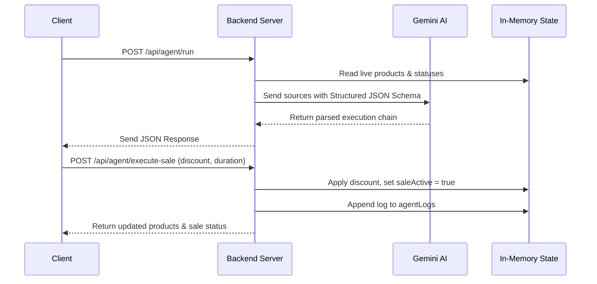

# Walkthrough: ShopAgent Backend Integration

We have successfully integrated the autonomous ShopAgent backend API endpoints into [server.ts](file:///c:/Users/MILLENNALS%20STOP/Downloads/garks---premium-style/server.ts) and verified that the entire codebase builds and typechecks cleanly with no errors.

## Changes Made

### 1. In-Memory Database and States
Added in-memory data structures inside [server.ts](file:///c:/Users/MILLENNALS%20STOP/Downloads/garks---premium-style/server.ts) to manage the state of the e-commerce inventory, active promotions, and logs without requiring complex file system operations.
- `productsDb`: Tracks the active products (including dynamic promotional pricing).
- `agentLogs`: Appends logs dynamically for autonomous audit trails.
- `saleActive` & `saleEndTime`: Tracks active flash sale state and countdown limits.

### 2. Multi-Source Integration Constants
Added `MOCK_SOURCES` representing 5 different data streams (Warehouse inventory, Supplier stock clearances, Sales dashboards, Customer reviews, and Traffic/N-55 blockages) used for reasoning.

### 3. ShopAgent Endpoints Added
- **`POST /api/agent/run`**: Feeds all mock sources and dynamic inventory database info to Gemini (`gemini-3-flash-preview`) with a strict structured JSON schema configuration. The model detects contradictions, staleness (>48 hours), analyzes constraints (PKR 50k budget, 1hr notice, 4hr duration), and returns an actionable retail chain.
- **`POST /api/agent/execute-sale`**: Updates in-memory prices to promotional values, flags the sale status, and records a trace.
- **`POST /api/agent/end-sale`**: Automatically restores product prices to their original values and clears states.
- **`GET /api/agent/logs`**: Retrieves the backend trace logs of all agent operations.
- **`POST /api/agent/log`**: Receives individual execution outcomes to store them inside the central log trace.
- **`GET /api/agent/products`**: Bonus utility endpoint to allow clients to fetch the live inventory status and active sale parameters.

---

## Verification & Type Safety

We ran the TypeScript compiler to ensure code correctness and build reliability:
```bash
npm run lint
```
- **Result**: `tsc --noEmit` completed with **exit code 0** and **zero type-checking errors**, validating that our changes comply with all TypeScript rules.

---

## Central Logs Preview
Below is a conceptual trace of how execution proceeds through the ShopAgent backend:



> [!NOTE]
> All in-memory structures are reset when the dev server is restarted. In a production environment, these can be seamlessly connected to standard databases.
