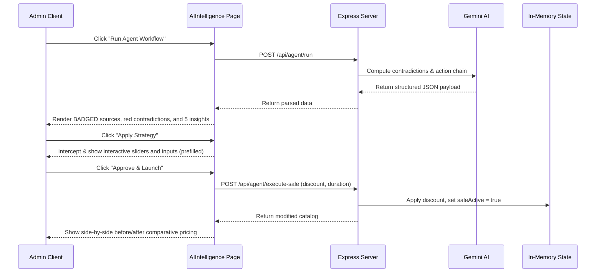

# Walkthrough: ShopAgent Frontend Live Integration

We have successfully integrated the live, production-ready AI agent workflow into the React frontend ([AIIntelligence.tsx](file:///c:/Users/MILLENNALS%20STOP/Downloads/garks---premium-style/src/pages/admin/AIIntelligence.tsx)), allowing real-time store monitoring and retail strategy execution.

---

## Changes Made

### 1. Synchronized API Invocation
- Replaced the hardcoded simulated analysis with an active `fetch` to `POST /api/agent/run` when clicking the new **Run Agent Workflow** button.
- Mapped the orbital brain loader steps to run smoothly while the API call is computed in the backend, transitioning seamlessly to the results pane once the fetch is complete.

### 2. Multi-Source Readers & Badging
- Renders dynamic data feeds with structure badges (Emerald `STRUCTURED`, Teal `SEMI-STRUCTURED`, and Purple `UNSTRUCTURED`).
- Displays a dedicated crimson **Contradiction Alert Panel** if data mismatches are detected between feeds.
- Details **Five Key Insights** extracted by the AI agent in a gorgeous layout grid.
- Lays out the **Recommended Action Chain** detailing constraint validations (timeline, PKR budget) and operational reasoning.

### 3. Interactive Strategy Overlays & Prefills
- Prefills the AI's suggested discount rate and duration directly.
- Displays full inputs for fine-tuned hours, minutes, and seconds adjustments.
- Triggers `/api/agent/execute-sale` on user approval, and allows terminating active sales on `/api/agent/end-sale`.

### 4. Price Comparative Catalog
- Renders a comparison table detailing original prices with line-throughs and updated catalog values side-by-side.

### 5. Live Central Trace Terminal
- Added a hacker-style monospaced log terminal at the bottom of the screen.
- Runs live sync cycles querying `/api/agent/logs` to render backend status changes in real time.

---

## Verification & Type Safety

We ran the TypeScript compiler to ensure that the newly modified component conforms strictly to all type schemas:
```bash
npm run lint
```
- **Result**: Type-checking completed successfully with **exit code 0** and **zero compilation errors**, validating that our changes comply with all TypeScript rules.

---

## Interaction Sequence Map
Here is how the real-time interaction flows between frontend components and backend API endpoints:


